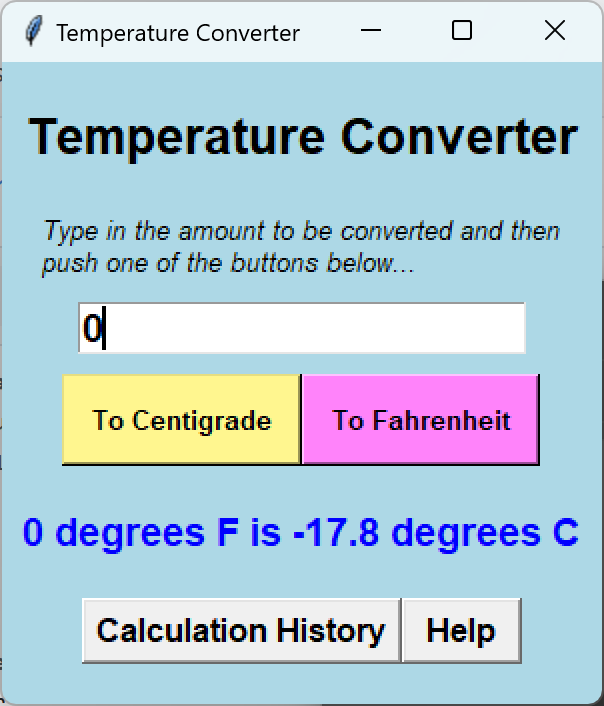
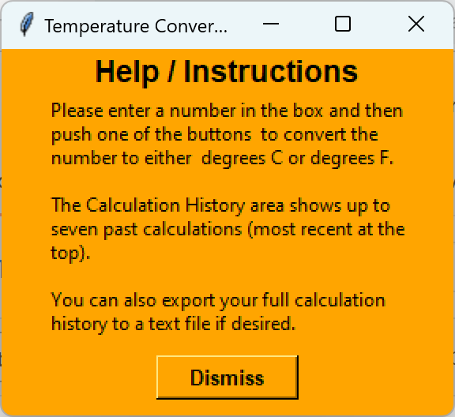
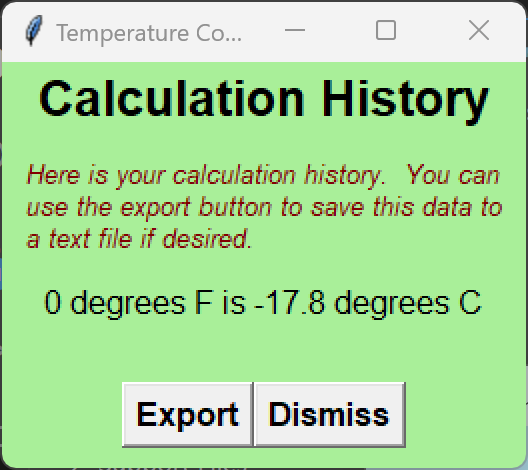

# Temperature Converter
Temperature Converter is a tool that facilitates conversions between degrees centrigrade and fahrenheit. In addition, the conversion history can be exported as a text file. It was created for my Digital Technologies class while in Year 13 of high school over the course of 3 weeks worth of classes. The purpose was to learn how to use python and tkinter to create a functional temperature converter contained in GUI windows with text and images.

The code is structured around each GUI window having its own class. This allowed for simpler bug fixing as each section was modularised as well as overall readability.

**Dependencies:**
* tkinter
* functools
* random
* re

**Screenshots:**

    

After creating this, I moved on to creating MysteryBoxGame to further improve my skills with Python and Tkinter.

Next time I would create a more elegant UI that appears more professional, perhaps by using PyQt or some other alternative.  
